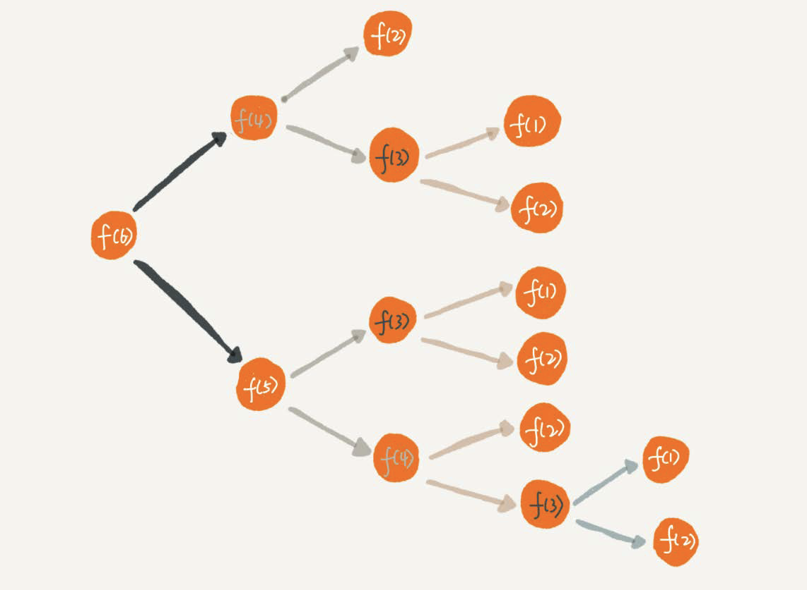

推荐注册返佣金的这个功能我想你应该不陌生吧？现在很多App都有这个功能。这个功能中，用户A推荐用户B来注册，用户B又推荐了用户C来注册。我们可以说，用户C的“最终推荐人”为用户A，用户B的“最终推荐人”也为用户A，而用户A没有“最终推荐人”。

一般来说，我们会通过数据库来记录这种推荐关系。在数据库表中，我们可以记录两行数据，其中actor_id表示用户id，referrer_id表示推荐人id。


基于这个背景，我的问题是，给定一个用户ID，如何查找这个用户的“最终推荐人”？ 带着这个问题，我们来学习今天的内容，递归（Recursion）！

### 如何理解“递归”？

从我自己学习数据结构和算法的经历来看，我个人觉得，**有两个最难理解的知识点，一个是动态规划，另一个就是递归**。

递归是一种应用非常广泛的算法（或者编程技巧）。之后我们要讲的很多数据结构和算法的编码实现都要用到递归，比如DFS深度优先搜索、前中后序二叉树遍历等等。所以，搞懂递归非常重要，否则，后面复杂一些的数据结构和算法学起来就会比较吃力。

不过，别看我说了这么多，递归本身可是一点儿都不“高冷”，咱们生活中就有很多用到递归的例子。

周末你带着女朋友去电影院看电影，女朋友问你，咱们现在坐在第几排啊？电影院里面太黑了，看不清，没法数，现在你怎么办？

别忘了你是程序员，这个可难不倒你，递归就开始排上用场了。于是你就问前面一排的人他是第几排，你想只要在他的数字上加一，就知道自己在哪一排了。但是，前面的人也看不清啊，所以他也问他前面的人。就这样一排一排往前问，直到问到第一排的人，说我在第一排，然后再这样一排一排再把数字传回来。直到你前面的人告诉你他在哪一排，于是你就知道答案了。

这就是一个非常标准的递归求解问题的分解过程，去的过程叫“递”，回来的过程叫“归”。基本上，所有的递归问题都可以用递推公式来表示。刚刚这个生活中的例子，我们用递推公式将它表示出来就是这样的：
`f(n)=f(n-1)+1 其中，f(1)=1`
f(n)表示你想知道自己在哪一排，f(n-1)表示前面一排所在的排数，f(1)=1表示第一排的人知道自己在第一排。有了这个递推公式，我们就可以很轻松地将它改为递归代码，如下：

```c
int f(int n) {
if (n == 1) return 1;
return f(n-1) + 1;
}
```

### 递归需要满足的三个条件

刚刚这个例子是非常典型的递归，那究竟什么样的问题可以用递归来解决呢？我总结了三个条件，只要同时满足以下三个条件，就可以用递归来解决。

- **一个问题的解可以分解为几个子问题的解**
  何为子问题？子问题就是数据规模更小的问题。比如，前面讲的电影院的例子，你要知道，“自己在哪一排”的问题，可以分解为“前一排的人在哪一排”这样一个子问题。

- **这个问题与分解之后的子问题，除了数据规模不同，求解思路完全一样**
  比如电影院那个例子，你求解“自己在哪一排”的思路，和前面一排人求解“自己在哪一排”的思路，是一模一样的。

- **存在递归终止条件**
  把问题分解为子问题，把子问题再分解为子子问题，一层一层分解下去，不能存在无限循环，这就需要有终止条件。
  还是电影院的例子，第一排的人不需要再继续询问任何人，就知道自己在哪一排，也就是f(1)=1，这就是递归的终止条件。

### 如何编写递归代码？

刚刚铺垫了这么多，现在我们来看，如何来写递归代码？我个人觉得，**写递归代码最关键的是写出递推公式，找到终止条件，剩下将递推公式转化为代码就很简单了**。

你先记住这个理论。我举一个例子，带你一步一步实现一个递归代码，帮你理解。

假如这里有n个台阶，每次你可以跨1个台阶或者2个台阶，请问走这n个台阶有多少种走法？如果有7个台阶，你可以2，2，2，1这样子上去，也可以1，2，1，1，2这样子上去，总之走法有很多，那如何用编程求得总共有多少种走法呢？

我们仔细想下，实际上，可以根据第一步的走法把所有走法分为两类，第一类是第一步走了1个台阶，另一类是第一步走了2个台阶。所以n个台阶的走法就等于先走1阶后，n-1个台阶的走法加上先走2阶后，n-2个台阶的走法。用公式表示就是：
$$
f(n) = f(n-1)+f(n-2)
$$
有了递推公式，递归代码基本上就完成了一半。我们再来看下终止条件。当有一个台阶时，我们不需要再继续递归，就只有一种走法。所以f(1)=1。这个递归终止条件足够吗？我们可以用n=2，n=3这样比较小的数试验一下。

n=2时，`f(2)=f(1)+f(0)`。如果递归终止条件只有一个`f(1)=1`，那f(2)就无法求解了。所以除了f(1)=1这一个递归终止条件外，还要有f(0)=1，表示走0个台阶有一种走法，不过这样子看起来就不符合正常的逻辑思维了。所以，我们可以把f(2)=2作为一种终止条件，表示走2个台阶，有两种走法，一步走完或者分两步来走。
所以，递归终止条件就是f(1)=1，f(2)=2。这个时候，你可以再拿n=3，n=4来验证一下，这个终止条件是否足够并且正确。
我们把递归终止条件和刚刚得到的递推公式放到一起就是这样的：
$$
f(1) = 1;
f(2) = 2;
f(n) = f(n-1)+f(n-2)
$$
有了这个公式，我们转化成递归代码就简单多了。最终的递归代码是这样的：

```c
int f(int n) {
if (n == 1) return 1;
if (n == 2) return 2;
return f(n-1) + f(n-2);
}
```

我总结一下，**写递归代码的关键就是找到如何将大问题分解为小问题的规律，并且基于此写出递推公式，然后再推敲终止条件，最后将递推公式和终止条件翻译成代码。**

虽然我讲了这么多方法，但是作为初学者的你，现在是不是还是有种想不太清楚的感觉呢？实际上，我刚学递归的时候，也有这种感觉，这也是文章开头我说递归代码比较难理解的地方。

刚讲的电影院的例子，我们的递归调用只有一个分支，也就是说“一个问题只需要分解为一个子问题”，我们很容易能够想清楚“递“和”归”的每一个步骤，所以写起来、理解起来都不难。

但是，当我们面对的是一个问题要分解为多个子问题的情况，递归代码就没那么好理解了。
像我刚刚讲的第二个例子，人脑几乎没办法把整个“递”和“归”的过程一步一步都想清楚。

计算机擅长做重复的事情，所以递归正和它的胃口。而我们人脑更喜欢平铺直叙的思维方式。当我们看到递归时，我们总想把递归平铺展开，脑子里就会循环，一层一层往下调，然后再一层一层返回，试图想搞清楚计算机每一步都是怎么执行的，这样就很容易被绕进去。

对于递归代码，这种试图想清楚整个递和归过程的做法，实际上是进入了一个思维误区。很多时候，我们理解起来比较吃力，主要原因就是自己给自己制造了这种理解障碍。那正确的思维方式应该是怎样的呢？

如果一个问题A可以分解为若干子问题B、C、D，你可以假设子问题B、C、D已经解决，在此基础上思考如何解决问题A。而且，你只需要思考问题A与子问题B、C、D两层之间的关系即可，不需要一层一层往下思考子问题与子子问题，子子问题与子子子问题之间的关系。屏蔽掉递归细节，这样子理解起来就简单多了。

因此，编写递归代码的关键是，只要遇到递归，我们就把它抽象成一个递推公式，不用想一层层的调用关系，不要试图用人脑去分解递归的每个步骤。

### 递归代码要警惕堆栈溢出

在实际的软件开发中，编写递归代码时，我们会遇到很多问题，比如堆栈溢出。而**堆栈溢出会造成系统性崩溃，后果会非常严重**。为什么递归代码容易造成堆栈溢出呢？我们又该如何预防堆栈溢出呢？

我在“栈”那一节讲过，函数调用会使用栈来保存临时变量。每调用一个函数，都会将临时变量封装为栈帧压入内存栈，等函数执行完成返回时，才出栈。系统栈或者虚拟机栈空间一般都不大。如果递归求解的数据规模很大，调用层次很深，一直压入栈，就会有堆栈溢出的风险。

比如前面的讲到的电影院的例子，如果我们将系统栈或者JVM堆栈大小设置为1KB，在求解f(19999)时便会出现如下堆栈报错：
`Exception in thread "main" java.lang.StackOverflowError`
那么，如何避免出现堆栈溢出呢？

我们可以通过在代码中**限制递归调用的最大深度的方式来解决这个问题**。递归调用超过一定深度（比如1000）之后，我们就不继续往下再递归了，直接返回报错。还是电影院那个例子，我们可以改造成下面这样子，就可以避免堆栈溢出了。不过，我写的代码是伪代码，为了代码简洁，有些边界条件没有考虑，比如x<=0。

```c
// 全局变量，表示递归的深度。
int depth = 0;
int f(int n) {
++depth；
if (depth > 1000) throw exception;
if (n == 1) return 1;
return f(n-1) + 1;
}
```

但这种做法并不能完全解决问题，因为最大允许的递归深度跟当前线程剩余的栈空间大小有关，事先无法计算。如果实时计算，代码过于复杂，就会影响代码的可读性。所以，如果最大深度比较小，比如10、50，就可以用这种方法，否则这种方法并不是很实用。

### 递归代码要警惕重复计算

除此之外，使用递归时还会出现重复计算的问题。刚才我讲的第二个递归代码的例子，如果我们把整个递归过程分解一下的话，那就是这样的：

从图中，我们可以直观地看到，想要计算f(5)，需要先计算f(4)和f(3)，而计算f(4)还需要计算f(3)，因此，f(3)就被计算了很多次，这就是重复计算问题。

为了避免重复计算，我们可以通过一个数据结构（比如散列表）来保存已经求解过的f(k)。当递归调用到f(k)时，先看下是否已经求解过了。如果是，则直接从散列表中取值返回，不需要重复计算，这样就能避免刚讲的问题了。

按照上面的思路，我们来改造一下刚才的代码：

```java
public int f(int n) {
if (n == 1) return 1;
if (n == 2) return 2;
// hasSolvedList可以理解成一个Map，key是n，value是f(n)
if (hasSolvedList.containsKey(n)) {
return hasSovledList.get(n);
}
int ret = f(n-1) + f(n-2);
hasSovledList.put(n, ret);
return ret;
}
```

除了堆栈溢出、重复计算这两个常见的问题。递归代码还有很多别的问题。
在时间效率上，递归代码里多了很多函数调用，当这些函数调用的数量较大时，就会积聚成一个可观的时间成本。在空间复杂度上，因为递归调用一次就会在内存栈中保存一次现场数据，所以在分析递归代码空间复杂度时，需要额外考虑这部分的开销，比如我们前面讲到的电影院递归代码，空间复杂度并不是O(1)，而是O(n)。

### 怎么将递归代码改写为非递归代码？

我们刚说了，**递归有利有弊，利是递归代码的表达力很强，写起来非常简洁；而弊就是空间复杂度高、有堆栈溢出的风险、存在重复计算、过多的函数调用会耗时较多等问题**。所以，在开发过程中，我们要根据实际情况来选择是否需要用递归的方式来实现。

那我们是否可以把递归代码改写为非递归代码呢？比如刚才那个电影院的例子，我们抛开场景，只看f(x) =f(x-1)+1这个递推公式。我们这样改写看看：

```c
int f(int n) {
int ret = 1;
for (int i = 2; i <= n; ++i) {
ret = ret + 1;
}
return ret;
}
```

同样，第二个例子也可以改为非递归的实现方式。

```c
int f(int n) {
if (n == 1) return 1;
if (n == 2) return 2;
int ret = 0;
int pre = 2;
int prepre = 1;
for (int i = 3; i <= n; ++i) {
ret = pre + prepre;
prepre = pre;
pre = ret;
}
return ret;
}
```

那是不是所有的递归代码都可以改为这种迭代循环的非递归写法呢？

笼统地讲，是的。因为递归本身就是借助栈来实现的，只不过我们使用的栈是系统或者虚拟机本身提供的，我们没有感知罢了。如果我们自己在内存堆上实现栈，手动模拟入栈、出栈过程，这样任何递归代码都可以改写成看上去不是递归代码的样子。

但是这种思路实际上是将递归改为了“手动”递归，本质并没有变，而且也并没有解决前面讲到的某些问题，徒增了实现的复杂度。

### 解答开篇

到此为止，递归相关的基础知识已经讲完了，咱们来看一下开篇的问题：如何找到“最终推荐人”？我的解决方案是这样的：

```java
long findRootReferrerId(long actorId) {
Long referrerId = select referrer_id from [table] where actor_id = actorId;
if (referrerId == null) return actorId;
return findRootReferrerId(referrerId);
}
```

是不是非常简洁？用三行代码就能搞定了，不过在实际项目中，上面的代码并不能工作，为什么呢？这里面有两个问题。
**第一，如果递归很深，可能会有堆栈溢出的问题。**
**第二，如果数据库里存在脏数据，我们还需要处理由此产生的无限递归问题**。比如demo环境下数据库中，测试工程师为了方便测试，会人为地插入一些数据，就会出现脏数据。如果A的推荐人是B，B的推荐人是C，C的推荐人是A，这样就会发生死循环。

第一个问题，我前面已经解答过了，可以用限制递归深度来解决。第二个问题，也可以用限制递归深度来解决。不过，还有一个更高级的处理方法，就是自动检测A-B-C-A这种“环”的存在。如何来检测环的存在呢？这个我暂时不细说，你可以自己思考下，后面的章节我们还会讲。

### 内容小结

关于递归的知识，到这里就算全部讲完了。我来总结一下。
递归是一种非常高效、简洁的编码技巧。只要是满足“三个条件”的问题就可以通过递归代码来解决。
不过递归代码也比较难写、难理解。**编写递归代码的关键就是不要把自己绕进去，正确姿势是写出递推公式，找出终止条件，然后再翻译成递归代码**。
递归代码虽然简洁高效，但是，递归代码也有很多弊端。比如，**堆栈溢出、重复计算、函数调用耗时多、空间复杂度高等**，所以，在编写递归代码的时候，一定要控制好这些副作用。

### 课后思考

我们平时调试代码喜欢使用IDE的单步跟踪功能，像规模比较大、递归层次很深的递归代码，几乎无法使用这种调试方式。对于递归代码，你有什么好的调试方法呢？